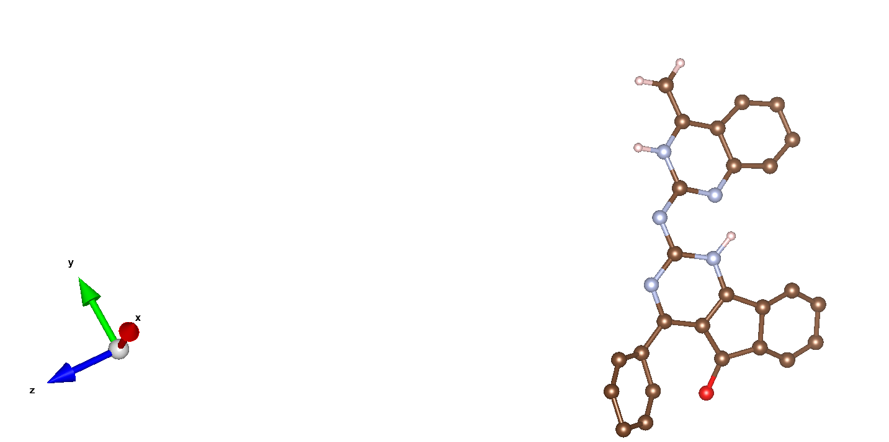
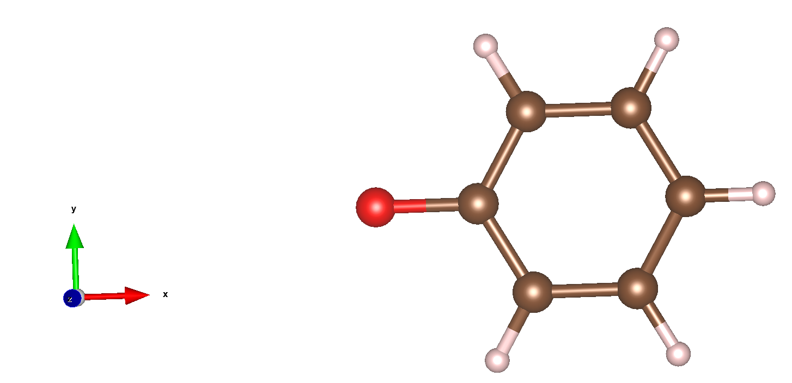
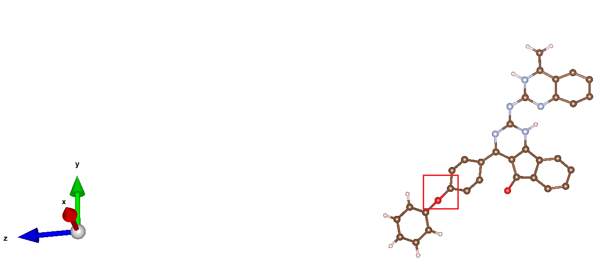

<!-- TOC -->

- [MOFkit](#mofkit)
  - [Installation](#installation)
    - [Environment](#environment)
    - [Compile](#compile)
    - [Configuration](#configuration)
  - [Remove Solvents](#remove-solvents)
    - [Description](#description)
    - [Usage](#usage)
    - [Example](#example)
  - [Find Space Groups](#find-space-groups)
    - [Description](#description-1)
    - [Usage](#usage-1)
    - [Example](#example-1)
    - [Problem &amp;&amp; Solution](#problem-ampamp-solution)
  - [In-Cell](#in-cell)
    - [Description](#description-2)
    - [Usage](#usage-2)
    - [Example](#example-2)
  - [ICSD' Classify And Unique](#icsd-classify-and-unique)
    - [Description](#description-3)
    - [Usage](#usage-3)
    - [Example](#example-3)
  - [CSD' Classify](#csd-classify)
    - [Description](#description-4)
    - [Usage](#usage-4)
    - [Example](#example-4)
  - [Format](#format)
    - [Description](#description-5)
    - [Usage](#usage-5)
    - [Example](#example-5)
  - [Splice Molecule](#splice-molecule)
    - [Description](#description-6)
    - [Usage](#usage-6)
    - [Example](#example-6)

<!-- /TOC -->
# MOFkit

---

## Installation


### Environment
* Linux
* GCC-5.4.0, need to support C ++ 11 and above
* Make

### Compile
* compile all files - `make` or `make all`
* compile specified function(`rm_mof_solvents/find_space_groups/in_cell/ICSD_classify/CSD_classify/format`) - `make func`
* delete executable - `make clean` 

### Configuration
* The program `Find Space Groups` is based on [spglib](https://github.com/atztogo/spglib). To use this function, you need to install and configure spglib. 
  ```shell
  $ git clone https://github.com/atztogo/spglib.git
  $ cd spglib
  $ mkdir _build
  $ cd _build
  $ cmake ..
  $ make
  $ make install
  ```

---

## Remove Solvents

### Description
The program is a tool to remove solvents from MOF.

### Usage
```
usage: ./bin/rm_mof_solvents --cif_in=string [options] ...
options:
  -i, --cif_in         input MOF cif file (string)
  -o, --output_path    output filepath (string [=])
  -f, --force          remove solvent molecules anyway
  -?, --help           print this message
```

### Example
```
$ ./bin/rm_mof_solvents -i ./examples/cod/ABAGAO.MOF_subset.cif -o ./examples/result
```
**log**
```
Parsing the cif file - ABAGAO.MOF_subset.cif
Getting some known resources...
Building base cell...
The number of bonded atom pairs is 80
Looking for solvent in ABAGAO.MOF_subset.cif
The calculated solvent molecule to be screened is [ H2O<known>  ]
The MOF framework is  [ C14CuH13N3O4  ]
Exporting result...
Export file ./example/result/ABAGAO_clean.cif successfully!
```
**./examples/result/ABAGAO_clean.cif**
```

#######################################################################
#
#                 Cambridge Crystallographic Data Centre
#                                CCDC
#
#######################################################################
#
# If this CIF has been generated from an entry in the Cambridge
# Structural Database, then it will include bibliographic, chemical,
# crystal, experimental, refinement or atomic coordinate data resulting
# from the CCDC's data processing and validation procedures.
#
#######################################################################

data_CSD_CIF_ABAGAO
_audit_creation_date 2016-11-22
_audit_creation_method CSD-ConQuest-V1
_database_code_CSD ABAGAO
_database_code_depnum_ccdc_archive 'CCDC 1498689'
_chemical_formula_sum 'C14 H15 Cu1 N3 O5'
_chemical_formula_moiety
;
(C14 H13 Cu1 N3 O4)n,H2 O1
;
_journal_coden_Cambridge 580
_journal_volume 119
_journal_year 2016
_journal_page_first 563
_journal_name_full 'Polyhedron '
loop_
_publ_author_name
"A.Timothy Royappa"
"A.D.Royappa"
"R.F.Moral"
"A.L.Rheingold"
"R.J.Papoular"
"D.M.Blum"
"T.Q.Duong"
"J.R.Stepherson"
"O.D.Vu"
"Banghao Chen"
"M.R.Suchomel"
"J.A.Golen"
"G.Andre"
"N.Kourkoumelis"
"A.D.Mercer"
"A.M.Pekarek"
"D.C.Kelly"
_chemical_name_systematic
;
catena-[(\m-ethanedioato)-(1-(pyridin-2-yl)-N-((pyridin-2-yl)methyl)methanamin
e)-copper(ii) monohydrate]
;
_chemical_name_common
;
catena-[(mu-oxalato)-(di-(2-picolyl)amine)-copper(ii) monohydrate]
;
_cell_volume   2959.318
_exptl_crystal_colour 'blue'
_exptl_crystal_density_diffrn 1.656
_exptl_crystal_description 'block'
_diffrn_ambient_temperature 100
#These two values have been output from a single CSD field.
_refine_ls_R_factor_gt 0.0362
_refine_ls_wR_factor_gt 0.0362
_symmetry_cell_setting orthorhombic
_symmetry_space_group_name_H-M 'P b c a'
_symmetry_Int_Tables_number 61
loop_
_symmetry_equiv_pos_site_id
_symmetry_equiv_pos_as_xyz
1 x,y,z
2 1/2-x,-y,1/2+z
3 -x,1/2+y,1/2-z
4 1/2+x,1/2-y,-z
5 -x,-y,-z
6 -1/2+x,y,-1/2-z
7 x,-1/2-y,-1/2+z
8 -1/2-x,-1/2+y,z
_cell_length_a 18.5834(8)
_cell_length_b 8.3215(4)
_cell_length_c 19.1366(7)
_cell_angle_alpha 90
_cell_angle_beta 90
_cell_angle_gamma 90
_cell_formula_units_Z 8
loop_
_atom_type_symbol
_atom_type_radius_bond
C 0.68
H 0.23
Cu 1.32
N 0.68
O 0.68
loop_
_atom_site_label
_atom_site_type_symbol
_atom_site_fract_x
_atom_site_fract_y
_atom_site_fract_z
Cu1 Cu 0.56165(2) 0.43062(4) 0.28700(2)
O1 O 0.64917(12) 0.5891(2) 0.34381(10)
O2 O 0.53447(12) 0.6511(2) 0.26192(10)
O3 O 0.65868(13) 0.8518(3) 0.36868(11)
O4 O 0.54528(12) 0.9114(2) 0.28233(11)
N1 N 0.50185(14) 0.4072(3) 0.37356(12)
N2 N 0.62594(15) 0.3848(3) 0.20563(12)
N3 N 0.60376(14) 0.2231(3) 0.32100(12)
H1 H 0.57550 0.13460 0.30130
C1 C 0.63138(17) 0.7346(4) 0.33832(15)
C2 C 0.59693(18) 0.2173(4) 0.39779(15)
H2 H 0.63600 0.27650 0.41940
H3 H 0.59900 0.10680 0.41390
C3 C 0.52577(18) 0.2912(4) 0.41742(15)
C4 C 0.67725(18) 0.2740(4) 0.21948(16)
C5 C 0.43969(19) 0.4820(4) 0.38716(16)
H4 H 0.42400 0.56200 0.35680
C6 C 0.56533(17) 0.7708(4) 0.29063(15)
C7 C 0.62106(19) 0.4481(4) 0.14073(16)
H5 H 0.58560 0.52410 0.13150
C8 C 0.39805(19) 0.4446(4) 0.44456(16)
H6 H 0.35500 0.49840 0.45300
C9 C 0.4219(2) 0.3252(4) 0.48922(17)
H7 H 0.39460 0.29690 0.52810
C10 C 0.67760(17) 0.2119(4) 0.29343(15)
H8 H 0.69380 0.10110 0.29430
H9 H 0.71010 0.27540 0.32190
C11 C 0.6675(2) 0.4028(4) 0.08760(17)
H10 H 0.66340 0.44730 0.04320
C12 C 0.4860(2) 0.2482(4) 0.47595(16)
H11 H 0.50260 0.16830 0.50590
C13 C 0.72500(19) 0.2248(4) 0.16824(18)
H12 H 0.76010 0.14840 0.17820
C14 C 0.7199(2) 0.2905(5) 0.10193(18)
H13 H 0.75190 0.25890 0.06710
Cu1B Cu 0.43835(2) 0.93062(4) 0.21300(2)
O4B O 0.45472(12) 0.4114(2) 0.21767(11)
loop_
_geom_bond_atom_site_label_1
_geom_bond_atom_site_label_2
_geom_bond_distance
_geom_bond_site_symmetry_1
_geom_bond_site_symmetry_2
Cu1 O1 2.359 1_555 1_555
O1 C1 1.259 1_555 1_555
O2 Cu1 1.963 1_555 1_555
O3 C1 1.243 1_555 1_555
O4 C6 1.238 1_555 1_555
N1 Cu1 2.004 1_555 1_555
N2 Cu1 1.999 1_555 1_555
N3 Cu1 2.004 1_555 1_555
H1 N3 0.980 1_555 1_555
C1 C6 1.559 1_555 1_555
C2 N3 1.476 1_555 1_555
H2 C2 0.970 1_555 1_555
H3 C2 0.971 1_555 1_555
C3 N1 1.354 1_555 1_555
C4 N2 1.353 1_555 1_555
C5 N1 1.338 1_555 1_555
H4 C5 0.930 1_555 1_555
C6 O2 1.274 1_555 1_555
C7 N2 1.352 1_555 1_555
H5 C7 0.930 1_555 1_555
C8 C5 1.379 1_555 1_555
H6 C8 0.931 1_555 1_555
C9 C8 1.383 1_555 1_555
H7 C9 0.931 1_555 1_555
C10 N3 1.473 1_555 1_555
H8 C10 0.970 1_555 1_555
H9 C10 0.970 1_555 1_555
C11 C7 1.386 1_555 1_555
H10 C11 0.930 1_555 1_555
C12 C3 1.389 1_555 1_555
H11 C12 0.930 1_555 1_555
C13 C4 1.384 1_555 1_555
H12 C13 0.931 1_555 1_555
C14 C11 1.377 1_555 1_555
H13 C14 0.931 1_555 1_555
Cu1B O4 2.395 1_555 1_555
O4B Cu1 2.395 1_555 1_555
C2 C3 1.506 1_555 1_555
C4 C10 1.507 1_555 1_555
C9 C12 1.376 1_555 1_555
C13 C14 1.385 1_555 1_555
#END
```

---

## Find Space Groups

### Description
The program is used to obtain the space group information in the cif file.(base on [spglib](https://github.com/atztogo/spglib))

### Usage
```
usage: ./bin/find_space_groups --input=string [options] ...
options:
  -i, --input         input cif file name (string)
  -v, --version       return the version of spglib
  -w, --why           this method is used to see roughly why  spglib failed
  -s, --spacegroup    internatioanl space group short symbol and number are obtained as a string
  -m, --symmetry      symmetry operations are obtained as a dictionary
  -r, --refine        standardized crystal structure is obtained as a tuple of lattice (a 3x3 numpy array), atomic scaled positions (a numpy array of [number_of_atoms,3]), and atomic numbers (a 1D numpy array) that are symmetrized following space group type.
  -p, --primitive     is found, lattice parameters (a 3x3 numpy array), scaled positions (a numpy array of [number_of_atoms,3]), and atomic numbers (a 1D numpy array) is returned.
  -d, --dataset       dataset,cell and symprec;angle_tolerance;hall_number;number;choice;transformation_matrix;origin shift;wyckoffs;site_symmetry_symbols;equivalent_atoms;mapping_to_primitive;rotations and translations;pointgroup;std_lattice;std_positions;std_types;std_rotation_matrix;std_mapping_to_primitive
  -c, --symmfdset     A set of crystallographic symmetry operations corresponding to hall_number is returned by a dictionary where rotation parts and translation parts are accessed by the keys rotations and translations, respectively.
  -f, --spgfdset      This function allows to directly access to the space-group-type database in spglib (spg_database.c). A dictionary is returned. To specify the space group type with a specific choice, hall_number is used.
  -n, --niggli        Niggli reduction is achieved using this method.
  -l, --delaunay      Delaunay reduction is achieved using this method.
  -k, --irrkpoints    Irreducible k-points are obtained from a sampling mesh of k-points
  -?, --help          print this message
```

### Example
```
$ ./bin/find_space_groups -i ./examples/cod/WAJZUE.cif -s
```

```
Parsing the cif file - WAJZUE.cif
Getting some known resources...
The space group is: Pbca 61
```

```
$ ./bin/find_space_groups -i ./examples/in-cell/ABETIN_clean.cif -s
```

```
Parsing the cif file - ABETIN_clean.cif
Getting some known resources...
The space group is: I4_1/acd 142
```

### Problem && Solution

* **error while loading shared libraries: libsymspg.so.1: cannot open shared object file: No such file or directory** because the program will default to `/lib64/libsymspg.so` not in `/lib64/.` Therefore, the following commands need to be added to allow the program to find the library in the directory of the instruction.

  `export LD_LIBRARY_PATH=$LD_LIBRARY_PATH:./include/spglib/_build`

  **spglib path please change according to the actual**

---


## In-Cell

### Description

This program will obtain its in-cell structure based on the space group information of the unit cell.

### Usage
```
usage: ./bin/in_cell --input_path=string --output_path=string [options] ...
options:
  -i, --input_path     input MOF cif file (string)
  -o, --output_path    output file path (string)
  -?, --help           print this message
```

### Example
```
$ ./bin/in_cell -i ./examples/cod/WAJZUE.cif -o ./examples/result
```
**log**
```
Getting some known resources...
Parsing the cif file - WAJZUE.cif
Exporting in-cell result...
Export file ./examples/result/WAJZUE_in_cell.cif successfully!
```

**./examples/result/WAJZUE_in_cell.cif**

```
#######################################################################
#
#                 Cambridge Crystallographic Data Centre
#                                CCDC 
#
#######################################################################
#
# If this CIF has been generated from an entry in the Cambridge 
# Structural Database, then it will include bibliographic, chemical, 
# crystal, experimental, refinement or atomic coordinate data resulting 
# from the CCDC's data processing and validation procedures.
#
#######################################################################
data_WAJZUE
_symmetry_space_group_name_H-M    "P 1"
_symmetry_int_tables_number 1
loop_
_symmetry_equiv_pos_as_xyz
'x, y, z'
_cell_length_a                   11.489(2)
_cell_length_b                   22.733(5)
_cell_length_c                   8.156(2)
_cell_angle_alpha                90
_cell_angle_beta                 90
_cell_angle_gamma                90
_cell_volume                     2130.18
loop_
_atom_site_label
_atom_site_type_symbol
_atom_site_fract_x
_atom_site_fract_y
_atom_site_fract_z
_atom_site_B_iso_or_equiv
Br1       Br        0.06709        0.19491        0.88381        1.000          
Br2       Br        0.06709        0.30509        0.38381        1.000          
Br3       Br        0.43291        0.69491        0.88381        1.000          
Br4       Br        0.43291        0.80509        0.38381        1.000          
Br5       Br        0.56709        0.19491        0.61619        1.000          
Br6       Br        0.56709        0.30509        0.11619        1.000          
Br7       Br        0.93291        0.69491        0.61619        1.000          
Br8       Br        0.93291        0.80509        0.11619        1.000          
C1        C         0.0042         0.63258        0.4821         1.000          
C2        C         0.0042         0.86742        0.9821         1.000          
C3        C         0.0513         0.6596         0.3253         1.000          
C4        C         0.0513         0.8404         0.8253         1.000          
C5        C         0.0535         0.5712         0.7403         1.000          
C6        C         0.0535         0.9288         0.2403         1.000          
C7        C         0.059          0.6075         0.9012         1.000          
C8        C         0.059          0.8925         0.4012         1.000          
C9        C         0.0987         0.59869        0.578          1.000          
C10       C         0.0987         0.90131        0.078          1.000          
C11       C         0.1417         0.52908        0.8228         1.000          
C12       C         0.1417         0.97092        0.3228         1.000          
C13       C         0.1596         0.6968         0.3524         1.000          
C14       C         0.1596         0.8032         0.8524         1.000          
C15       C         0.1607         0.5697         0.964          1.000          
C16       C         0.1607         0.9303         0.464          1.000          
C17       C         0.2083         0.63515        0.5989         1.000          
C18       C         0.2083         0.86485        0.0989         1.000          
C19       C         0.2467         0.161          0.4388         1.000          
C20       C         0.2467         0.339          0.9388         1.000          
C21       C         0.2533         0.661          0.4388         1.000          
C22       C         0.2533         0.839          0.9388         1.000          
C23       C         0.2917         0.13515        0.5989         1.000          
C24       C         0.2917         0.36485        0.0989         1.000          
C25       C         0.3393         0.0697         0.964          1.000          
C26       C         0.3393         0.4303         0.464          1.000          
C27       C         0.3404         0.1968         0.3524         1.000          
C28       C         0.3404         0.3032         0.8524         1.000          
C29       C         0.3583         0.02908        0.8228         1.000          
C30       C         0.3583         0.47092        0.3228         1.000          
C31       C         0.4013         0.09869        0.578          1.000          
C32       C         0.4013         0.40131        0.078          1.000          
C33       C         0.441          0.1075         0.9012         1.000          
C34       C         0.441          0.3925         0.4012         1.000          
C35       C         0.4465         0.0712         0.7403         1.000          
C36       C         0.4465         0.4288         0.2403         1.000          
C37       C         0.4487         0.1596         0.3253         1.000          
C38       C         0.4487         0.3404         0.8253         1.000          
C39       C         0.4958         0.13258        0.4821         1.000          
C40       C         0.4958         0.36742        0.9821         1.000          
C41       C         0.5042         0.63258        0.0179         1.000          
C42       C         0.5042         0.86742        0.5179         1.000          
C43       C         0.5513         0.6596         0.1747         1.000          
C44       C         0.5513         0.8404         0.6747         1.000          
C45       C         0.5535         0.5712         0.7597         1.000          
C46       C         0.5535         0.9288         0.2597         1.000          
C47       C         0.559          0.6075         0.5988         1.000          
C48       C         0.559          0.8925         0.0988         1.000          
C49       C         0.5987         0.59869        0.922          1.000          
C50       C         0.5987         0.90131        0.422          1.000          
C51       C         0.6417         0.52908        0.6772         1.000          
C52       C         0.6417         0.97092        0.1772         1.000          
C53       C         0.6596         0.6968         0.1476         1.000          
C54       C         0.6596         0.8032         0.6476         1.000          
C55       C         0.6607         0.5697         0.536          1.000          
C56       C         0.6607         0.9303         0.036          1.000          
C57       C         0.7083         0.63515        0.9011         1.000          
C58       C         0.7083         0.86485        0.4011         1.000          
C59       C         0.7467         0.161          0.0612         1.000          
C60       C         0.7467         0.339          0.5612         1.000          
C61       C         0.7533         0.661          0.0612         1.000          
C62       C         0.7533         0.839          0.5612         1.000          
C63       C         0.7917         0.13515        0.9011         1.000          
C64       C         0.7917         0.36485        0.4011         1.000          
C65       C         0.8393         0.0697         0.536          1.000          
C66       C         0.8393         0.4303         0.036          1.000          
C67       C         0.8404         0.1968         0.1476         1.000          
C68       C         0.8404         0.3032         0.6476         1.000          
C69       C         0.8583         0.02908        0.6772         1.000          
C70       C         0.8583         0.47092        0.1772         1.000          
C71       C         0.9013         0.09869        0.922          1.000          
C72       C         0.9013         0.40131        0.422          1.000          
C73       C         0.941          0.1075         0.5988         1.000          
C74       C         0.941          0.3925         0.0988         1.000          
C75       C         0.9465         0.0712         0.7597         1.000          
C76       C         0.9465         0.4288         0.2597         1.000          
C77       C         0.9487         0.1596         0.1747         1.000          
C78       C         0.9487         0.3404         0.6747         1.000          
C79       C         0.9958         0.13258        0.0179         1.000          
C80       C         0.9958         0.36742        0.5179         1.000          
H1        H         0.0086         0.1839         0.2238         1.000          
H2        H         0.0086         0.3161         0.7238         1.000          
H3        H         0.0107         0.1042         0.5324         1.000          
H4        H         0.0107         0.3958         0.0324         1.000          
H5        H         0.0524         0.0116         0.8466         1.000          
H6        H         0.0524         0.4884         0.3466         1.000          
H7        H         0.0571         0.1046         0.048          1.000          
H8        H         0.0571         0.3954         0.548          1.000          
H9        H         0.0696         0.6283         0.2485         1.000          
H10       H         0.0696         0.8717         0.7485         1.000          
H11       H         0.0796         0.6484         0.884          1.000          
H12       H         0.0796         0.8516         0.384          1.000          
H13       H         0.14           0.7309         0.4182         1.000          
H14       H         0.14           0.7691         0.9182         1.000          
H15       H         0.1466         0.5519         0.0702         1.000          
H16       H         0.1466         0.9481         0.5702         1.000          
H17       H         0.1801         0.186          0.4613         1.000          
H18       H         0.1801         0.314          0.9613         1.000          
H19       H         0.1889         0.7105         0.2476         1.000          
H20       H         0.1889         0.7895         0.7476         1.000          
H21       H         0.1925         0.667          0.6749         1.000          
H22       H         0.1925         0.833          0.1749         1.000          
H23       H         0.1966         0.5474         0.4405         1.000          
H24       H         0.1966         0.9526         0.9405         1.000          
H25       H         0.2211         0.1294         0.3674         1.000          
H26       H         0.2211         0.3706         0.8674         1.000          
H27       H         0.2315         0.1107         0.6467         1.000          
H28       H         0.2315         0.3893         0.1467         1.000          
H29       H         0.2353         0.5897         0.9618         1.000          
H30       H         0.2353         0.9103         0.4618         1.000          
H31       H         0.2647         0.0897         0.9618         1.000          
H32       H         0.2647         0.4103         0.4618         1.000          
H33       H         0.2685         0.6107         0.6467         1.000          
H34       H         0.2685         0.8893         0.1467         1.000          
H35       H         0.2789         0.6294         0.3674         1.000          
H36       H         0.2789         0.8706         0.8674         1.000          
H37       H         0.3034         0.0474         0.4405         1.000          
H38       H         0.3034         0.4526         0.9405         1.000          
H39       H         0.3075         0.167          0.6749         1.000          
H40       H         0.3075         0.333          0.1749         1.000          
H41       H         0.3111         0.2105         0.2476         1.000          
H42       H         0.3111         0.2895         0.7476         1.000          
H43       H         0.3199         0.686          0.4613         1.000          
H44       H         0.3199         0.814          0.9613         1.000          
H45       H         0.3534         0.0519         0.0702         1.000          
H46       H         0.3534         0.4481         0.5702         1.000          
H47       H         0.36           0.2309         0.4182         1.000          
H48       H         0.36           0.2691         0.9182         1.000          
H49       H         0.4204         0.1484         0.884          1.000          
H50       H         0.4204         0.3516         0.384          1.000          
H51       H         0.4304         0.1283         0.2485         1.000          
H52       H         0.4304         0.3717         0.7485         1.000          
H53       H         0.4429         0.6046         0.048          1.000          
H54       H         0.4429         0.8954         0.548          1.000          
H55       H         0.4476         0.5116         0.8466         1.000          
H56       H         0.4476         0.9884         0.3466         1.000          
H57       H         0.4893         0.6042         0.5324         1.000          
H58       H         0.4893         0.8958         0.0324         1.000          
H59       H         0.4914         0.6839         0.2238         1.000          
H60       H         0.4914         0.8161         0.7238         1.000          
H61       H         0.5086         0.1839         0.2762         1.000          
H62       H         0.5086         0.3161         0.7762         1.000          
H63       H         0.5107         0.1042         0.9676         1.000          
H64       H         0.5107         0.3958         0.4676         1.000          
H65       H         0.5524         0.0116         0.6534         1.000          
H66       H         0.5524         0.4884         0.1534         1.000          
H67       H         0.5571         0.1046         0.452          1.000          
H68       H         0.5571         0.3954         0.952          1.000          
H69       H         0.5696         0.6283         0.2515         1.000          
H70       H         0.5696         0.8717         0.7515         1.000          
H71       H         0.5796         0.6484         0.616          1.000          
H72       H         0.5796         0.8516         0.116          1.000          
H73       H         0.64           0.7309         0.0818         1.000          
H74       H         0.64           0.7691         0.5818         1.000          
H75       H         0.6466         0.5519         0.4298         1.000          
H76       H         0.6466         0.9481         0.9298         1.000          
H77       H         0.6801         0.186          0.0387         1.000          
H78       H         0.6801         0.314          0.5387         1.000          
H79       H         0.6889         0.7105         0.2524         1.000          
H80       H         0.6889         0.7895         0.7524         1.000          
H81       H         0.6925         0.667          0.8251         1.000          
H82       H         0.6925         0.833          0.3251         1.000          
H83       H         0.6966         0.5474         0.0595         1.000          
H84       H         0.6966         0.9526         0.5595         1.000          
H85       H         0.7211         0.1294         0.1326         1.000          
H86       H         0.7211         0.3706         0.6326         1.000          
H87       H         0.7315         0.1107         0.8533         1.000          
H88       H         0.7315         0.3893         0.3533         1.000          
H89       H         0.7353         0.5897         0.5382         1.000          
H90       H         0.7353         0.9103         0.0382         1.000          
H91       H         0.7647         0.0897         0.5382         1.000          
H92       H         0.7647         0.4103         0.0382         1.000          
H93       H         0.7685         0.6107         0.8533         1.000          
H94       H         0.7685         0.8893         0.3533         1.000          
H95       H         0.7789         0.6294         0.1326         1.000          
H96       H         0.7789         0.8706         0.6326         1.000          
H97       H         0.8034         0.0474         0.0595         1.000          
H98       H         0.8034         0.4526         0.5595         1.000          
H99       H         0.8075         0.167          0.8251         1.000          
H100      H         0.8075         0.333          0.3251         1.000          
H101      H         0.8111         0.2105         0.2524         1.000          
H102      H         0.8111         0.2895         0.7524         1.000          
H103      H         0.8199         0.686          0.0387         1.000          
H104      H         0.8199         0.814          0.5387         1.000          
H105      H         0.8534         0.0519         0.4298         1.000          
H106      H         0.8534         0.4481         0.9298         1.000          
H107      H         0.86           0.2309         0.0818         1.000          
H108      H         0.86           0.2691         0.5818         1.000          
H109      H         0.9204         0.1484         0.616          1.000          
H110      H         0.9204         0.3516         0.116          1.000          
H111      H         0.9304         0.1283         0.2515         1.000          
H112      H         0.9304         0.3717         0.7515         1.000          
H113      H         0.9429         0.6046         0.452          1.000          
H114      H         0.9429         0.8954         0.952          1.000          
H115      H         0.9476         0.5116         0.6534         1.000          
H116      H         0.9476         0.9884         0.1534         1.000          
H117      H         0.9893         0.6042         0.9676         1.000          
H118      H         0.9893         0.8958         0.4676         1.000          
H119      H         0.9914         0.6839         0.2762         1.000          
H120      H         0.9914         0.8161         0.7762         1.000          
O1        O         0.0571         0.04482        0.7805         1.000          
O2        O         0.0571         0.45518        0.2805         1.000          
O3        O         0.1199         0.54806        0.4732         1.000          
O4        O         0.1199         0.95194        0.9732         1.000          
O5        O         0.1689         0.02088        0.2969         1.000          
O6        O         0.1689         0.47912        0.7969         1.000          
O7        O         0.3311         0.52088        0.2969         1.000          
O8        O         0.3311         0.97912        0.7969         1.000          
O9        O         0.3801         0.04806        0.4732         1.000          
O10       O         0.3801         0.45194        0.9732         1.000          
O11       O         0.4429         0.54482        0.7805         1.000          
O12       O         0.4429         0.95518        0.2805         1.000          
O13       O         0.5571         0.04482        0.7195         1.000          
O14       O         0.5571         0.45518        0.2195         1.000          
O15       O         0.6199         0.54806        0.0268         1.000          
O16       O         0.6199         0.95194        0.5268         1.000          
O17       O         0.6689         0.02088        0.2031         1.000          
O18       O         0.6689         0.47912        0.7031         1.000          
O19       O         0.8311         0.52088        0.2031         1.000          
O20       O         0.8311         0.97912        0.7031         1.000          
O21       O         0.8801         0.04806        0.0268         1.000          
O22       O         0.8801         0.45194        0.5268         1.000          
O23       O         0.9429         0.54482        0.7195         1.000          
O24       O         0.9429         0.95518        0.2195         1.000          


#END
```
 
---

## ICSD' Classify And Unique

### Description
The program classifies ICSD cif files and removes duplicate files.

classification rules - `component/element type/space group/`

### Usage
```
usage: ./bin/ICSD_classify --input_dir=string --output_dir=string [options] ...
options:
  -i, --input_dir     icsd folder location (string)
  -o, --output_dir    classification result export location (string)
  -l, --log           print the detail log, no log by default
  -?, --help          print this message
```

### Example
```
$ ./bin/ICSD_classify -i ./examples/icsd -o ./examples/icsd_classify
```
---

## CSD' Classify

### Description
This program is used to remove files containing metal elements, disorder molecules and known solvents from the CSD database. You can specify to exclude only certain metal elements. The result may contain two folders, the folder `csd_warning` indicates that the atoms in the structure are bonded to two or more parts, and the folder `csd_normal` indicates that the atoms in the structure will only be bonded to one part.


### Usage

```
usage: ./bin/csd_classify --input_dir=string --output_dir=string [options] ...
options:
  -i, --input_dir     csd folder location (string)
  -o, --output_dir    classification result export location (string)
  -r, --remove        only remove the cif which contains special elements or special bonds(the input form likes special meatal/special bonds(Fe|Cu/Fe-O|C-O&C-H) or only input one of them, please use '/' as separators for elements and bonds) (string [=])
  -k, --keep          only keep the cif which contains special elements and special bond(the input form likes special meatal/special bonds(Fe|Cu/Fe-O|C-O&C-H) or only input one of them, please use '/' as separators for elements and bonds (string [=])
  -l, --log           print the detail log, no log by default
  -u, --unique        remove duplicate files
  -?, --help          print this message
```

### Example

```
./bin/CSD_classify -i ./examples/csd -o ./examples/csd_classify
```

---

## Format

### Description

The program is used to convert the cif file into a file of another format. It supports customizing the atomic coordinates (atomic fractional coordinates / cartesian coordinates) in the conversion result and converting the molecular structure to in-cell or asymmetric mode.

### Usage
```
usage: ./bin/format --input=string --output=string --type=string [options] ...
options:
  -i, --input         input file (string)
  -o, --output        output path of the conversion result  (string)
  -m, --mode          the mode of the format conversion(in-cell/asymmetric) (string [=asymmetric])
  -t, --type          the type of the result format(gjf/vasp), convert format to vasp file format or gaussion format (string)
  -c, --coord_type    the type of the coordinate(fract/cart), the coordinates of the atom in the conversion result are fractional coordinates or cartesian coordinates (string [=fract])
  -?, --help          print this message
```

### Example

**convert to gaussion file**
```
$ ./bin/format -i ./examples/cod/WAJZUE.cif -o ./examples/result -t gjf
```

**convert to vasp file**
```
$ ./bin/format -i ./examples/cod/WAJZUE.cif -o ./examples/result -t vasp
```

---


## Splice Molecule

### Description

The program is used to splice A and B molecules according to specified atoms.

### Usage

```
usage: ./bin/splice_molecule --molecule_a=string --molecule_b=string --output=string --type=string --connect_a=int --connect_b=int [options] ...
options:
  -a, --molecule_a    path of the molecule A (string)
  -b, --molecule_b    path of the molecule B (string)
  -o, --output        the output path (string)
  -t, --type          the type of the result format(gjf/xyz), convert format to gaussion format or xyz format (string)
  -i, --connect_a     the serial number of connect site in molecule A (int)
  -j, --connect_b     the serial number of connect site in molecule B (int)
  -?, --help          print this message
```

### Example

```
$ ./bin/splice_molecule -a ./examples/mol/molecule-A-label.mol -b ./examples/mol/molecule-B-label.mol -i 31 -j 7 -t gjf -o ./examples/mol
```

> the red box represents the specified spliced atom


**Molecule A**



**Molecule B**



**Splice Result**



---